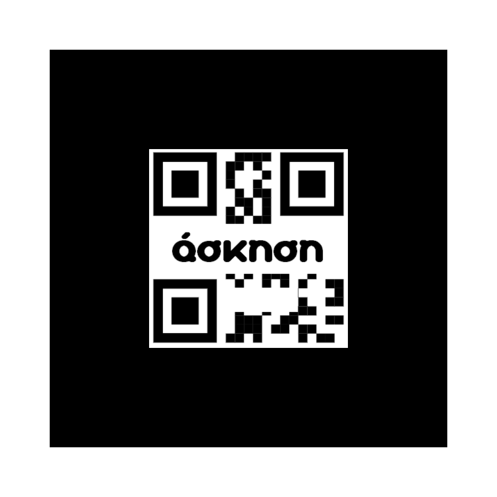

## Αρχεία OER

### Προέλευση Υλικού
Το υλικό που περιέχεται σε αυτό το αποθετήριο προέρχεται από την πλατφόρμα e-me.

### Περιεχόμενα
- `README.md`: Πληροφορίες για το αποθετήριο.
- `LICENSE`: Πληροφορίες για την άδεια χρήσης.
- `QR1.png`: QR code που οδηγεί σε άσκηση Drag Text.
- `QR2.png`: QR code που οδηγεί σε αρχείο τρισδιάστατου μοντέλου.

### Οδηγίες
Τα αρχεία H5P μπορείτε να τα ανοίξετε απευθείας στον περιηγητή σας πατώντας στους παρακάτω συνδέσμους:

- [Αναγνώριση Δωρικού Ρυθμού σε 3D Απεικόνιση.h5p](https://content.e-me.edu.gr/wp-admin/admin-ajax.php?action=h5p_embed&id=1396886)
- [Διαδραστική Ανάλυση Αρχαίου Ελληνικού Κειμένου.h5p](https://content.e-me.edu.gr/wp-admin/admin-ajax.php?action=h5p_embed&id=1396882)
- [Διαδραστικός Πίνακας Κλίσης Αρθρών.h5p](https://content.e-me.edu.gr/wp-admin/admin-ajax.php?action=h5p_embed&id=1396879)
- [Διαδραστικός Χάρτης της Αρχαίας Ελλάδας.h5p](https://content.e-me.edu.gr/wp-admin/admin-ajax.php?action=h5p_embed&id=1396885)
- [Εξάσκηση με Flashcards Λεξιλόγιο και Ορισμοί.h5p](https://content.e-me.edu.gr/wp-admin/admin-ajax.php?action=h5p_embed&id=1396888)

### Οδηγίες για το OER "Αναγνώριση Δωρικού Ρυθμού σε 3D Απεικόνιση"
Για να χρησιμοποιήσετε το OER "Αναγνώριση Δωρικού Ρυθμού σε 3D Απεικόνιση", ακολουθήστε τα παρακάτω βήματα:

1. Ενεργοποιήστε την κάμερα της συσκευής σας.
2. Στρέψτε την κάμερα προς τους παρακάτω κωδικούς QR.
3. Αφού η κάμερα αναγνωρίσει τους κωδικούς, το OER θα εκκινήσει αυτόματα.

#### QR1

Ο παραπάνω κωδικός QR αναφέρεται στο OER "Αναγνώριση Δωρικού Ρυθμού σε 3D Απεικόνιση" και χρησιμοποιείται για να παρέχει γρήγορη πρόσβαση σε περιεχόμενο που σχετίζεται με αυτό το αρχείο H5P - άσκηση πολλαπλής επιλογής.

#### QR2

Ο παραπάνω κωδικός QR αναφέρεται επίσης στο OER "Αναγνώριση Δωρικού Ρυθμού σε 3D Απεικόνιση" και χρησιμοποιείται για να παρέχει γρήγορη πρόσβαση σε περιεχόμενο που σχετίζεται με αυτό το αρχείο H5P - αρχείο τρισδιάστατου μοντέλου.

### Δημιουργός
Το υλικό στο αποθετήριο αυτό δημιουργήθηκε από την Ελένη Σαμαρά.

### Άδεια
Το υλικό αυτό διατίθεται υπό την άδεια Creative Commons Attribution-NonCommercial-ShareAlike 3.0 Greece License (CC BY-NC-SA 3.0 GR). Ανατρέξτε στο αρχείο `LICENSE` για περισσότερες πληροφορίες.

